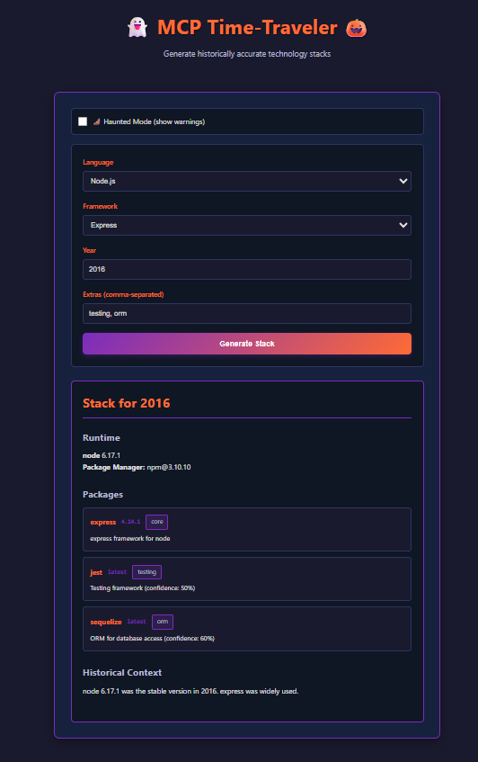
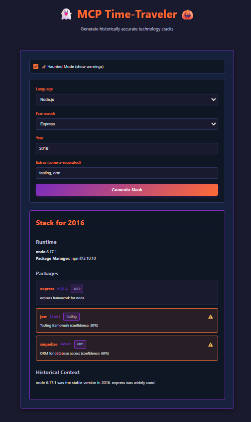
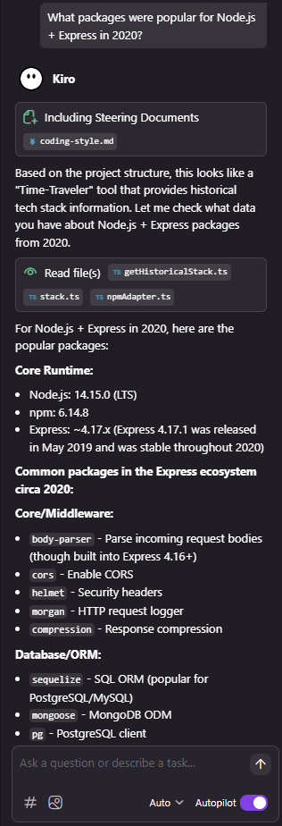

# 👻 MCP Time-Traveler 🎃

> Travel back in time to recreate historically accurate developer environments

[](https://kiro.ai)
[](https://www.typescriptlang.org/)
[](https://modelcontextprotocol.io/)

## Overview

**MCP Time-Traveler** is a Kiroween hackathon project that generates historically accurate technology stacks for any year between 2015-2025. It fetches real package versions from npm, PyPI, and RubyGems registries, applies intelligent version-picking algorithms, and presents results with confidence scoring.

**Key Features:**
- 🕐 **Time-based version selection** - Pick the right package versions for any year
- 📦 **Real registry lookups** - Fetches actual release data from npm, PyPI, RubyGems
- 🎯 **Confidence scoring** - Know when version data is uncertain
- 🦇 **Haunted Mode** - Highlights low-confidence packages with warnings
- 🎃 **Kiroween theme** - Dark purple and orange UI with spooky vibes
- 🤖 **MCP integration** - Works as a Model Context Protocol tool for AI assistants

**Supported Languages:**
- Node.js (Express)
- Python (Django, Flask)
- Ruby (Rails)

## How It Works

```
┌─────────────┐      ┌─────────────┐      ┌──────────────────┐
│   Web UI    │─────▶│  Express    │─────▶│  npm Registry    │
│  (React)    │      │    API      │      │  PyPI Registry   │
└─────────────┘      └─────────────┘      │  RubyGems API    │
                            │              └──────────────────┘
                            │
                            ▼
                     ┌─────────────┐
                     │   Version   │
                     │   Picker    │
                     │  Algorithm  │
                     └─────────────┘
                            │
                            ▼
                     ┌─────────────┐
                     │ Confidence  │
                     │   Scoring   │
                     └─────────────┘
```

**Architecture:**
1. **Web UI** sends stack request (language, framework, year)
2. **API** fetches package versions from registries
3. **Version Picker** filters versions by release date
4. **Confidence Scorer** evaluates data quality (0.5 = fallback, 0.9 = accurate)
5. **Response** includes runtime, packages, and historical context

**MCP Integration:**
The project includes a standalone MCP server that exposes `get_historical_stack` as a tool for AI assistants like Kiro, enabling conversational queries about historical tech stacks.

## Features

✨ **Core Functionality:**
- Real-time package version discovery from public registries
- Runtime version selector (Node, Python, Ruby)
- Package manager version mapping
- Framework version recommendations
- Confidence scoring for version accuracy

🎨 **User Experience:**
- Haunted Mode with warning indicators
- Kiroween-themed dark UI (purple & orange)
- Keyboard-friendly forms
- Responsive card layouts
- Real-time loading states

🛠️ **Developer Experience:**
- Custom MCP server for AI integration
- Spec-driven development with Kiro
- Automated hooks (scaffold generation, pre-commit checks)
- Steering documents for coding standards
- Shared TypeScript types across modules

## Tech Stack

**Frontend:**
- React 18 + TypeScript
- Vite (dev server & build)
- CSS3 (custom Kiroween theme)

**Backend:**
- Express + TypeScript
- Axios (registry API calls)
- CORS enabled

**MCP Server:**
- @modelcontextprotocol/sdk
- stdio transport
- TypeScript

**Kiro Features:**
- Specs (requirements & design docs)
- Hooks (gen:scaffold, pre-commit)
- Steering (coding style guide)
- MCP integration

## Project Structure

```
mcp-time-traveler/
├── apps/
│   ├── api/                    # Express REST API
│   │   ├── src/
│   │   │   ├── server.ts       # Entry point
│   │   │   ├── routes/         # API endpoints
│   │   │   ├── services/       # Business logic
│   │   │   └── types/          # TypeScript types
│   │   ├── package.json
│   │   └── tsconfig.json
│   │
│   └── web/                    # React frontend
│       ├── src/
│       │   ├── main.tsx        # Entry point
│       │   ├── pages/          # Page components
│       │   ├── components/     # UI components
│       │   ├── types/          # TypeScript types
│       │   └── styles.css      # Kiroween theme
│       ├── index.html
│       ├── package.json
│       └── vite.config.ts
│
├── mcp-server/                 # MCP tool server
│   ├── src/
│   │   ├── index.ts            # MCP server setup
│   │   ├── tools/              # MCP tool implementations
│   │   ├── adapters/           # Registry API adapters
│   │   ├── core/               # Version picker logic
│   │   └── types/              # TypeScript types
│   ├── package.json
│   └── tsconfig.json
│
├── shared/
│   └── types/                  # Shared TypeScript types
│       └── stack.ts
│
├── .kiro/
│   ├── specs/                  # Requirements & design docs
│   │   ├── app-spec.md
│   │   └── mcp-spec.md
│   ├── hooks/                  # Automation hooks
│   │   ├── gen-scaffold.yml
│   │   └── pre-commit.yml
│   └── steering/               # Coding guidelines
│       └── coding-style.md
│
├── README.md
└── LICENSE
```

## Getting Started (Local Dev)

### Prerequisites
- Node.js 18+ and npm
- Git

### Installation

1. **Clone the repository:**
   ```bash
   git clone https://github.com/yourusername/mcp-time-traveler.git
   cd mcp-time-traveler
   ```

2. **Install dependencies:**
   ```bash
   # API
   cd apps/api
   npm install
   cd ../..

   # Web
   cd apps/web
   npm install
   cd ../..

   # MCP Server
   cd mcp-server
   npm install
   cd ..
   ```

### Running the Application

**Terminal 1 - Start the API:**
```bash
cd apps/api
npm run dev
```
API runs on http://localhost:4000

**Terminal 2 - Start the Web UI:**
```bash
cd apps/web
npm run dev
```
Web UI runs on http://localhost:3000

**Terminal 3 - Build MCP Server (optional):**
```bash
cd mcp-server
npm run build
```

### Testing the API

**Example: Node.js + Express (2020)**
```bash
curl -X POST http://localhost:4000/api/generate \
  -H "Content-Type: application/json" \
  -d '{
    "language": "node",
    "framework": "express",
    "year": 2020,
    "extras": ["testing", "orm"]
  }'
```

**Example: Python + Django (2018)**
```bash
curl -X POST http://localhost:4000/api/generate \
  -H "Content-Type: application/json" \
  -d '{
    "language": "python",
    "framework": "django",
    "year": 2018,
    "extras": ["testing"]
  }'
```

## Example Requests

### Node.js + Express (2015)
```json
{
  "language": "node",
  "framework": "express",
  "year": 2015,
  "extras": []
}
```

**Response:**
```json
{
  "language": "node",
  "framework": "express",
  "year": 2015,
  "runtime_version": "4.9.1",
  "package_manager": "npm@3.10.10",
  "packages": [
    {
      "name": "express",
      "version": "4.13.4",
      "category": "core",
      "notes": "express framework for node"
    }
  ],
  "notes": "node 4.9.1 was the stable version in 2015."
}
```

### Python + Django (2018)
```json
{
  "language": "python",
  "framework": "django",
  "year": 2018,
  "extras": ["testing"]
}
```

**Response:**
```json
{
  "language": "python",
  "framework": "django",
  "year": 2018,
  "runtime_version": "3.7.17",
  "package_manager": "pip@10.0.1",
  "packages": [
    {
      "name": "django",
      "version": "2.1.15",
      "category": "core",
      "notes": "django framework for python"
    },
    {
      "name": "pytest",
      "version": "latest",
      "category": "testing",
      "notes": "Testing framework (confidence: 90%)"
    }
  ],
  "notes": "python 3.7.17 was the stable version in 2018."
}
```

## Screenshots

### Main Interface

*Kiroween-themed interface with dark purple and orange accents*

### Haunted Mode

*Low-confidence packages highlighted with warning icons*

### MCP Integration

*Using the tool in Kiro AI assistant*

## How Kiro Was Used

This project was built entirely using **Kiro AI** as the primary development tool, showcasing the power of AI-assisted development:

### 🎯 Spec-Driven Development
- Created detailed specs in `.kiro/specs/` for requirements and MCP tool design
- Used specs as source of truth for code generation
- Iteratively refined specs based on implementation feedback

### 🪝 Automation Hooks
- **gen:scaffold** - Regenerates project structure from specs
- **pre-commit** - Runs type checks before commits
- Hooks defined in `.kiro/hooks/` and triggered via Kiro UI

### 🎨 Steering Documents
- Coding style guide in `.kiro/steering/coding-style.md`
- Enforces small functions, clear naming, and TypeScript conventions
- Guides all code generation for consistency

### 🤖 MCP Extension
- Built custom MCP server for Kiro integration
- Enables conversational queries about historical stacks
- Demonstrates MCP protocol in

### 💬 Vibe Coding
- Natural language instructions for feature development
- Iterative refinement through conversation
- Context-aware code generation

**Result:** A complete full-stack application built in hours, not days, with consistent code quality and comprehensive documentation.

## MCP Server Usage

### Configure in Kiro

Add to `.kiro/mcp.json`:
```json
{
  "mcpServers": {
    "time-traveler": {
      "command": "node",
      "args": ["/absolute/path/to/mcp-server/dist/index.js"]
    }
  }
}
```

### Example MCP Query

In Kiro chat:
```
What packages were popular for Node.js + Express in 2020?
```

Kiro will use the `get_historical_stack` tool to fetch accurate version data.

## Testing Haunted Mode

See [TESTING_HAUNTED_MODE.md](./TESTING_HAUNTED_MODE.md) for detailed testing instructions.

**Quick Test:**
1. Enable "🦇 Haunted Mode" checkbox
2. Select: Node.js, Express, Year 2016
3. Add extras: `testing, orm`
4. Low-confidence packages will show ⚠️ warning icons

## License

MIT License - see [LICENSE](./LICENSE) for details.

## Credits

**Built for Kiroween Hackathon 2024** 🎃

**Author:** [Your Name]

**Powered by:**
- [Kiro AI](https://kiro.ai) - AI-powered IDE
- [Model Context Protocol](https://modelcontextprotocol.io/) - MCP SDK
- npm, PyPI, RubyGems - Package registries

**Special Thanks:**
- Kiro team for the amazing AI development experience
- Open source community for package registry APIs

---

*Made with 👻 and ☕ during Kiroween 2024*
